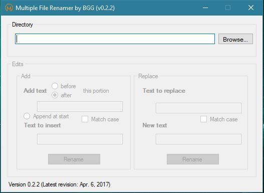

# Multiple File Renamer

This repo includes some of my practice with Visual Basic. It contains a small program that allows for mass renaming of files in a directory. There are settings to specify a point or pattern at which text should be appended or replaced.

## Screenshot

